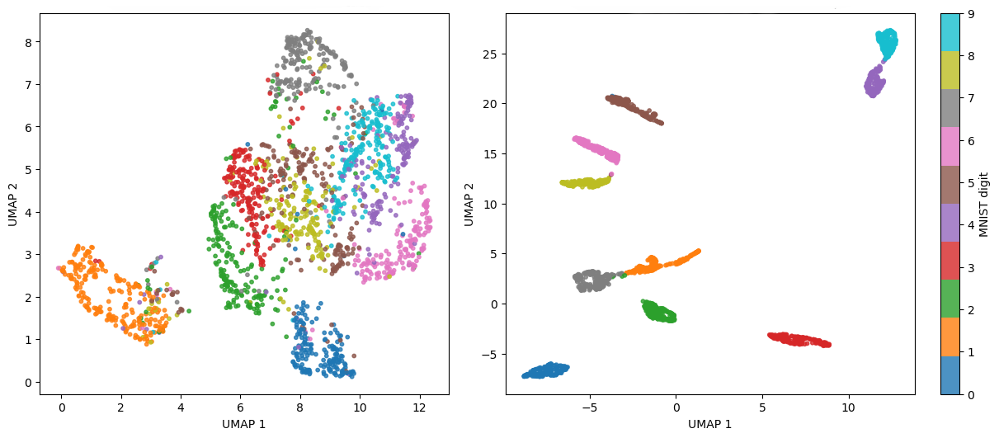
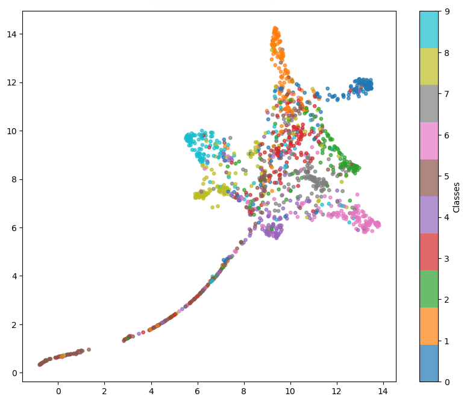
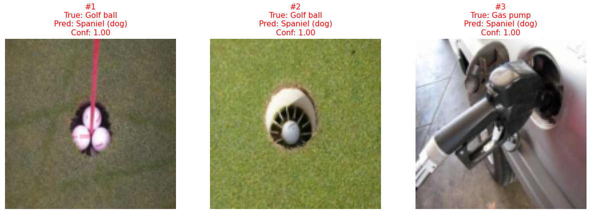

# High Dimensionality Visualization

> A series of experiments using UMAP visualization, written using Jupyter notebooks with PyTorch.

<p align="center">
  
</p>

<p align="center">
  <em>UMAP projection of the last features map of an untrained ResNet18 (left) VS trained ResNet18 (right) on MNIST classes</em>
</p>

<p align="center">
  &nbsp;&nbsp;&nbsp;&nbsp;
  
</p>

<p align="center">
  <em>UMAP projection of the last features map of a ResNet50 trained on Imagenette (left) and its top 3 errors by confidence (right)</em>
</p>

## About this project

This project was developed as part of my second year of Master's degree. Its goal is to explore the visualization of high-dimensional data and the evolution of neural network latent spaces using UMAP. The idea here is to highlight *what* the models actually learn through training rather than just how they perform like it is usually the case.

The experiments range from basic dimensionality reduction to analyzing out-of-distribution behavior, with representation of data via UMAP as well as analysis of models' errors.

## Brief introduction

Visualizing high-dimensional data, such as the 2048-dimensional latent space of a ResNet50, is crucial for moving beyond the "black box" nature of deep neural networks. It allows us to understand how a model organizes semantic concepts, verify class separation, and visually detect out-of-distribution anomalies. However, projecting thousands of dimensions down to a readable 2D or 3D space without losing information is a significant mathematical challenge.

Historically, two main algorithms have dominated this field, each with its own limitations:

*   **PCA (Principal Component Analysis):** Data is projected onto orthogonal axes that maximize global variance. This technique is computationally efficient and excellent at capturing the overall data spread (global structure), but it fails entirely to unfold the more complex non-linear manifolds typically learned by deep neural networks.
*   **t-SNE (t-Distributed Stochastic Neighbor Embedding):** High-dimensional Euclidean distances between data points are converted into probability distributions. This technique excels at preserving local neighborhoods, creating tight distinct clusters, but it severely distorts global topology, meaning the distance between different clusters is often arbitrary and meaningless. It also scales very poorly with large datasets.

**UMAP (Uniform Manifold Approximation and Projection)** is an alternative visualization technique that allows to preserve both local and global data structures, while remaining computationally efficient. It works in the following way:

### 1. High-dimensional topological representation
UMAP assumes that the data is **uniformly distributed across a locally connected Riemannian manifold**. It approximates this manifold by constructing a fuzzy topological structure (essentially a weighted k-nearest neighbor graph). 

To account for varying data densities, UMAP creates a local distance metric around each data point $x_i$. The probability (or fuzzy weight) of an edge existing between $x_i$ and $x_j$ is defined as:

$$p_{i|j} = \exp\left(-\frac{d(x_i, x_j) - \rho_i}{\sigma_i}\right)$$

Where:
*   $d(x_i, x_j)$ is the standard distance metric (e.g., Euclidean),
*   $\rho_i$ is the distance to the nearest neighbor,
*   $\sigma_i$ is a smoothing parameter adapted to the local density.

These local representations are then combined to form a global high-dimensional graph $P$.

### 2. Low-dimensional optimization
UMAP initializes a low-dimensional embedding and then constructs a similar fuzzy graph $Q$ in this lower-dimensional space, using a curve akin to the Student's t-distribution to model edge weights $q_{ij}$.

The layout is finally optimized by minimizing the fuzzy set cross-entropy between the high-dimensional representation $P$ and the low-dimensional representation $Q$:

$$CE(P, Q) = \sum_{i \neq j} \left[ p_{ij} \log\left(\frac{p_{ij}}{q_{ij}}\right) + (1 - p_{ij}) \log\left(\frac{1 - p_{ij}}{1 - q_{ij}}\right) \right]$$

The first term acts as an attractive force pulling similar points together, while the second acts as a repulsive force pushing dissimilar points apart. This gives a cluster map representing the data either in 2D or 3D.

In the notebooks the choice has been made to represent the data in 2D.

## Repository structure & overview

The project is divided into 6 Jupyter notebooks, each focusing on a specific experiment:

```text
HighDim-Visualization/
├── assets/
├── exp0.ipynb
├── exp1.ipynb
├── exp2.ipynb
├── exp3.ipynb
├── exp4.ipynb
├── exp5.ipynb
└── README.md
```

* **`Exp 0` : Baseline UMAP projections**  
  Dimensionality reduction on raw flattened images from MNIST (grayscale, 28x28) and Imagenette (RGB, 64x64).
* **`Exp 1` : Layer-by-layer visualization**  
  Training a multi-layer neural network on a synthetic 2D spiral dataset. The notebook extracts and plots the latent space at different depths of the network.
* **`Exp 2` : Transfer learning**  
  Comparing a ResNet18 trained from scratch versus one initialized with ImageNet weights. Analysis of the model's confidence distribution for correct VS incorrect predictions and highlighting overconfidence.
* **`Exp 3` : Progressive learning**  
  Training a ResNet50 on Imagenette. UMAP projections are generated progressively during training to visualize cluster formation. Also estimating the top 3 "worst" classification errors.
* **`Exp 4` : Generalization of UMAP embeddings**  
  Testing the robustness of UMAP by fitting the manifold on different training sample sizes (500 vs. 5000) and projecting unseen test data onto the learned embeddings.
* **`Exp 5` : Out-of-distribution (OOD) behavior**  
  Extracting features from a ResNet18 trained exclusively on MNIST, and projecting KMNIST (Japanese Kuzushiji characters) into this latent space to observe how the network groups unknown distributions.

## Datasets used

- **MNIST**: 10-class grayscale handwritten digits.
- **KMNIST**: 10-class historical Japanese characters (only used for OOD testing).
- **Imagenette (v2)**: A 10-class subset of ImageNet.
- **Toy Spiral**: A custom synthetic 3-class 2D spiral dataset.

All datasets are downloaded automatically if needed during the execution of the notebooks and stored in a local `./data` folder.


## Dependencies

To run the notebooks, you will need the following libraries:
- `torch`
- `torchvision`
- `umap-learn`
- `matplotlib`
- `numpy`
- `requests` & `tarfile` (standard libraries)

## Usage

Simply clone the repository and run the notebooks. They are completely independent.

```bash
git clone https://github.com/thmspllgr/HighDim-Visualization.git
cd HighDim-Visualization
```
Launch Jupyter Notebook or Jupyter Lab and open any `expX.ipynb` file. Run all cells. 

## Additional notes

- Performances can vary from one run to another (especially on experiment 1), the results in the notebooks have been obtained using the parameters already present when you initially download the repo (no need to change anything).
- Imports are systematically separated in two cells, this has been done to avoid a kernel crash on my end but it is not necessary to keep it that way if it works for you.
